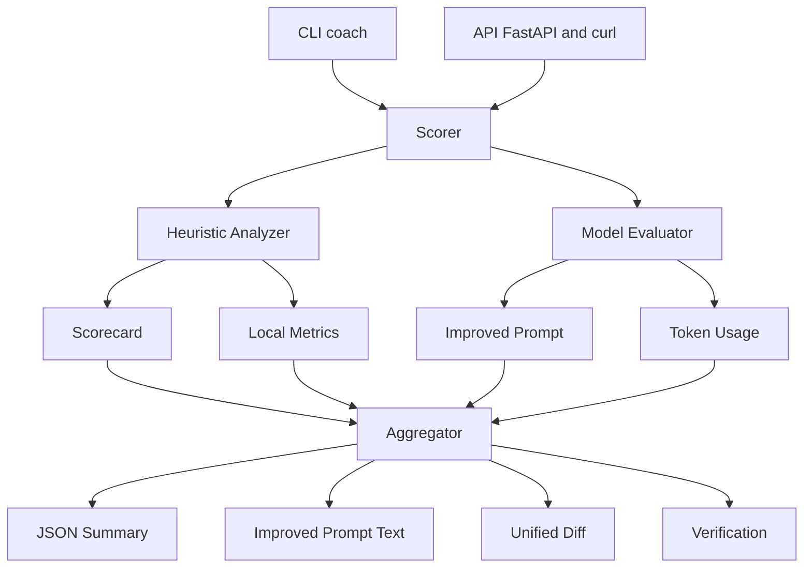

# 🧠 Prompt Coach (AI Prompt Optimizer)

Prompt Coach is an AI-powered prompt analysis and rewriting tool built to help teams *write better prompts for Copilot and other LLMs*.
It combines **heuristic scoring**, **GPT-based critique**, and **structured rewriting** to produce clean, verifiable, and organization-ready prompts.

---

## 🔍 What It Does

Prompt Coach takes any raw prompt (from Copilot, ChatGPT, or documentation) and:

1. **Scores it** on six axes:

   * **Clarity** – single purpose, explicit audience
   * **Context** – relevant stack, versions, constraints
   * **Constraints** – technical or policy requirements
   * **Format Contract** – structured output (YAML / JSON / table / code-only)
   * **Guardrails** – anti-hallucination & verification paths
   * **Acceptance Criteria** – testable results

2. **Uses OpenAI’s API** (e.g. `gpt-4o-mini`) to critique the prompt and produce an improved, structured rewrite following the house style:

   ```
   [ROLE SETUP]
   [CONTEXT]
   [TASK]
   [FORMAT CONTRACT]
   [GUARDRAILS]
   [ACCEPTANCE]
   ```

3. **Outputs**:

   * A numeric score (0-100)
   * A detailed scorecard
   * A rewritten prompt (“Copilot-ready”)
   * A unified diff of before vs after
   * Verification commands & notes
   * Token usage metrics for cost tracking

4. **Works offline** (heuristics only) or online (model judgement).

---

## 🧩 Why It Exists

Copilot adoption fails when prompts are vague, unsafe, or inconsistent.
Prompt Coach enforces the *Common Prompt Patterns* defined in your `copilot_common_library.md` by scoring and rewriting prompts to follow those standards automatically.

It’s essentially your team’s **AI prompt linter + editor**, delivering:

* Repeatable prompt quality
* Training data for enablement workshops
* Objective metrics for ROI tracking
* Less time spent debugging AI responses

---

## ⚙️ How It Works (Architecture Overview)

```
CLI or API input
     ↓
Local Heuristic Scorer
     ↓
GPT Evaluator (OpenAI API)
     ↓
Aggregator → Final Score
     ↓
Improved Prompt + Diff + JSON Result
```

* **coach/heuristics.py** – regex-based keyword checks (fast, free)
* **coach/openai_client.py** – sends structured chat prompt to OpenAI
* **coach/scorer.py** – merges local + model scores and produces the diff
* **coach/utils.py** – helpers for JSON parsing, unified diff, token usage
* **coach/api.py** – FastAPI service (`/score`, `/health`)
* **coach/cli.py** – command-line interface and entry point

---

## 🚀 Quick Start

### 1. Setup

```bash
cd prompt-coach
python -m venv .venv && source .venv/bin/activate
pip install -e .
cp .env.example .env
```

Edit `.env` to include your API key:

```
OPENAI_API_KEY=sk-yourkey
```

### 2. Run from the CLI

With your alias (`coach`) or directly:

```bash
coach -f samples/sample_prompt_bad.txt --show-diff
coach -f samples/sample_prompt_bad.txt --print-improved
```

### 3. Run the API

```bash
uvicorn coach.api:app --port 8088 --reload
```

Test:

```bash
curl -s localhost:8088/health
curl -s localhost:8088/score \
  -H 'content-type: application/json' \
  -d '{"text":"Write a bash script that tails a log and alerts on ERROR"}' | jq
```

### 4. Offline mode (heuristics only)

To skip API calls:

```bash
export PROMPT_COACH_OFFLINE=1
coach -f myprompt.txt
```

---

## 📊 Example Output

```json
{
  "local_score": 38,
  "model_score": 72,
  "final_score": 55,
  "scorecard": {
    "Clarity": 18,
    "Context": 15,
    "Constraints": 10,
    "FormatContract": 20,
    "Guardrails": 12,
    "Acceptance": 8
  },
  "improved": "Act as a senior Ansible reviewer...\n",
  "diff": "@@ -1 +1,9 @@\n- write postgres stuff\n+ Act as a senior Ansible reviewer...\n",
  "verification": ["ansible-lint playbook.yml"],
  "notes": ["Prompt improved for context and guardrails"],
  "usage": {"model": "gpt-4o-mini", "total_tokens": 485}
}
```

---

## 🧱 Integration Ideas

* **CI/CD** – run on pull requests touching `copilot-prompts/**/*.md`; post a comment with the score
* **Enablement workshops** – use it live to rewrite developer prompts
* **Data quality pipeline** – export prompt metrics for ROI dashboards
* **Offline Linter** – pre-commit hook that warns on poor score

---

## 🧭 Key Concepts

* **Heuristic score**: pattern-based analysis (fast, deterministic).
* **Model score**: GPT’s semantic judgement using the system prompt.
* **Improved prompt**: a rewrite enforcing *Common Prompt Patterns*.
* **Verification commands**: shell checks to prove output validity.
* **Diff view**: shows exactly how the prompt was improved.

---

## 🧠 Developer Notes

* Model and timeout are configurable:

  ```bash
  export PROMPT_COACH_MODEL=gpt-4o
  export PROMPT_COACH_TIMEOUT=45
  ```
* Add more patterns in `coach/templates.py`.
* Unit tests live under `tests/` and avoid network calls.
* Token usage is tracked in results for cost insight.

---

## 🧩 Behind the Scenes (Architecture)



**How it flows:**

1. **CLI or API input** — The user provides a raw prompt.
2. **Scorer** — Calls two evaluators:

   * **Heuristic Analyzer:** pattern-based static checks.
   * **Model Evaluator:** GPT-4o-mini judges and rewrites.
3. **Aggregator** — merges local + model scores into a final score and assembles the result payload.
4. **Renderer** — CLI prints JSON, improved text, or diff; API returns JSON.

**Key files:**

| File                     | Role                                       |
| ------------------------ | ------------------------------------------ |
| `coach/heuristics.py`    | Regex & keyword-based scoring engine       |
| `coach/scorer.py`        | Orchestrator of heuristics + model         |
| `coach/openai_client.py` | OpenAI API communication layer             |
| `coach/utils.py`         | JSON/diff utilities & model usage tracking |
| `coach/api.py`           | FastAPI service endpoints                  |
| `coach/cli.py`           | Command-line interface for local runs      |

---

## 🔁 Common Workflows

| Scenario                         | Command / Flow                               | Output                   | Notes                                                  |
| -------------------------------- | -------------------------------------------- | ------------------------ | ------------------------------------------------------ |
| **Improve a single prompt**      | `coach -f prompt.txt --print-improved`       | Rewritten prompt text    | Ideal for quickly polishing Copilot prompts.           |
| **Show before/after comparison** | `coach -f prompt.txt --show-diff`            | Unified diff             | Visualizes what changed and why.                       |
| **Generate full JSON analysis**  | `coach -f prompt.txt`                        | Full scorecard JSON      | Great for feeding into dashboards or pipelines.        |
| **Batch test prompts**           | `python tools/bench.py`                      | CSV of name, file, score | Measures team prompt quality over time.                |
| **Serve as an API**              | `uvicorn coach.api:app --reload --port 8088` | REST endpoints           | Integrates with Notion, CI/CD, or frontend dashboards. |
| **Run in offline mode**          | `PROMPT_COACH_OFFLINE=1 coach -f ...`        | Heuristic-only result    | Free testing without consuming API credits.            |
| **Auto-lint in CI**              | GitHub Action (planned)                      | PR comment with score    | Ensures prompt standards before merge.                 |

---

### 🧭 Typical Dev Loop

1. Draft your Copilot prompt.
2. Run `coach -f myprompt.txt --show-diff`.
3. Review the improved version.
4. Accept or tweak it manually.
5. Commit the final prompt to `copilot-prompts/<domain>/`.

This mirrors **code review** — but for **prompt quality**.

